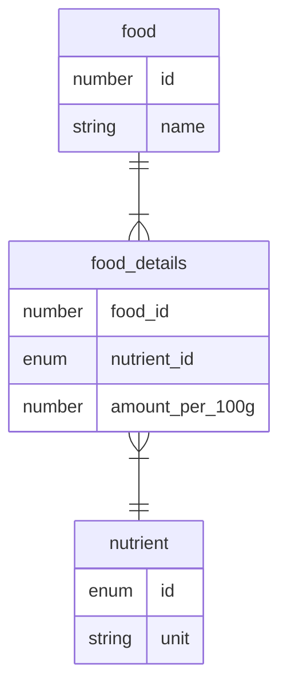

# Database ER diagram



## Details

### food (食品 table)

| Physical name | nullable | Describe |
| ------------- | -------- | -------- |
| id            | X        | PK       |
| name          | X        | 食品名   |

### food_details (食品詳細 table)

交差テーブル

| Physical name   | nullable | Describe                                                   |
| --------------- | -------- | ---------------------------------------------------------- |
| food_id         | X        | 複合 PK                                                    |
| nutrient_id     | X        | 複合 PK                                                    |
| amount_per_100g | X        | 食品 100g 当たりの栄養素の量。単位は nutrient テーブル依存 |

### nutrient (栄養素 table)

| Physical name | nullable | Describe                   |
| ------------- | -------- | -------------------------- |
| id            | X        | PK (e.g. enercKcal, water) |
| unit          | X        | 量の単位 (e.g. g, mg, μg)  |

## Memo

- 柔軟な検索やソートを可能にするため、食物は DB (SQLite) を使う。
- nutrient の和名・英名はアプリ内の辞書 (i18n, id -> name の pair) にする。DB には格納しない。
  - 理由は、翻訳が容易だから
  - DB に格納すると、言語が増えるたびカラムが増えることになるから

# No-Database data design

```json
{
  "my_salads": [
    {
      "name": "my 1st salad",
      "selected_foods": [
        {
          "food_id": 0,
          "amount": 1000
        }
      ]
    },
    {
      "name": "Sss",
      "selected_foods": [
        {
          "food_id": 2,
          "amount": 200
        },
        {
          "food_id": 11,
          "amount": 50
        }
      ]
    }
  ]
}
```

## Memo

- ユーザー作成のサラダ一覧を DB に持たせるメリットは特にないため、 on memory に JSON として保持する
